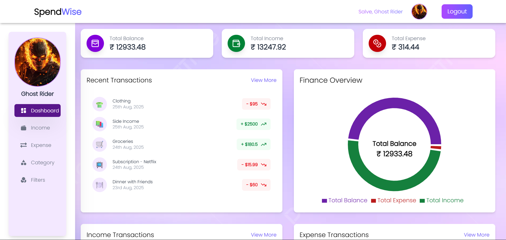
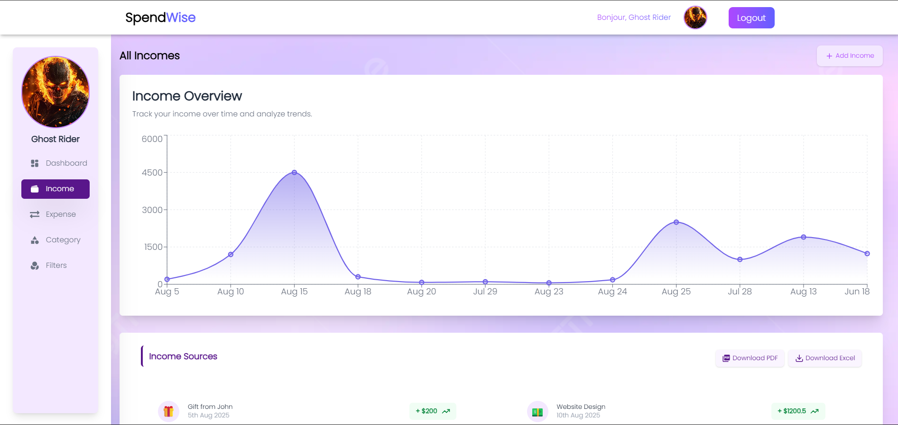
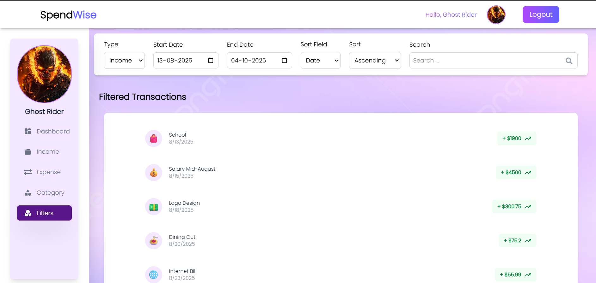
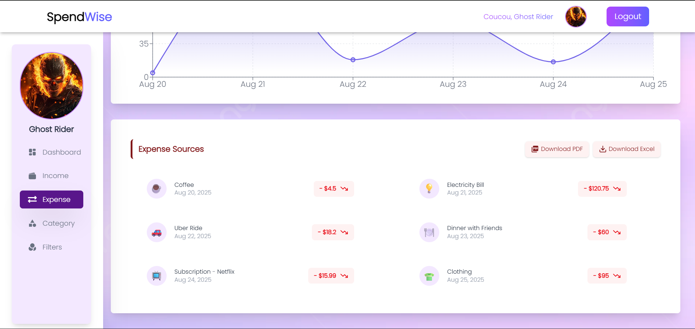
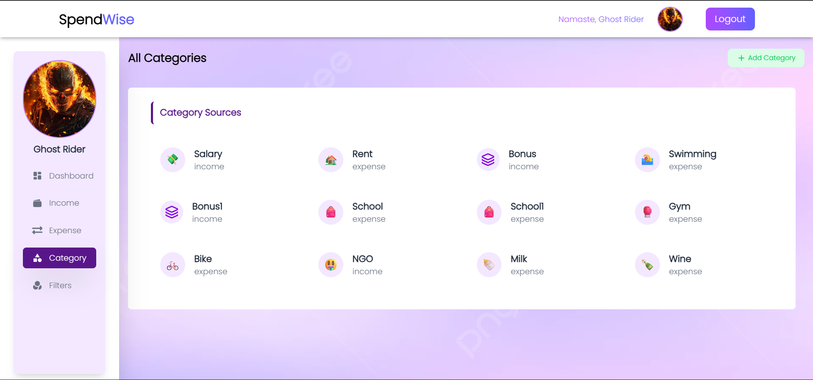

# 💰 Income & Expense Tracker

A **fully functional income and expense management app** built with **React.js** (frontend) and **Spring Boot** (backend).  
The app allows users to **track income, expenses, categories, and profile details**, with rich features like charts, notifications, email reminders, and secure authentication.

---

## 🚀 Features

✅ Register and Login with JWT Authentication  
✅ Manage **Income & Expenses** with input validation  
✅ Upload profile picture to **Cloudinary**  
✅ Category selection with **emoji picker**  
✅ Real-time feedback using **React Hot Toast**  
✅ Analyze financial data using **React Charts**  
✅ Filter transactions by category  
✅ Download and Email transactions  
✅ Loading spinners with **Lucide React Icons**

---

## 🖼️ App Pages

- `/` → **Root**
- `/health` → Health check page
- `/batman` → Fun/error placeholder page
- `/error` → Error page
- `/login` → User login
- `/signup` → User signup
- `/dashboard` → Home dashboard
- `/income` → Income management
- `/expense` → Expense management
- `/filter` → Filter data by category/date
- `/category` → Category management
- `/update-profile` → Update profile (with Cloudinary image upload)

---

## 🛠️ Tech Stack

### Frontend

- ⚛️ **React.js**
- 🎨 **Tailwind CSS**
- 🔔 **React Hot Toast**
- 🎭 **Lucide React Icons**
- 😃 **Emoji Picker**
- 📊 **React Charts**
- 🌐 **Axios**

### Backend

- ☕ **Spring Boot**
- 🗄️ **Spring Data JPA**
- 🛡️ **Spring Security + JWT**
- 🐬 **MySQL Database**

---

## 🔐 Authentication

- User passwords are securely hashed.
- JWT tokens are used for protected routes.

---

## 📸 Screenshots

### 🔑 Login Page

### 📝 Signup Page

### 📊 Dashboard (Home)

### 💰 Income Page

### 🔍 Filter Page

### 💸 Expense Page

### 📂 Category Page

### 👤 Update Profile Page

### ⚠️ Error Page

## 

## 📧 Contact

👤 **Nakul Attrey**  
📩 nakulattrey@gmail.com
🌐 [Portfolio](https://bio.site/nakulattreydev)
